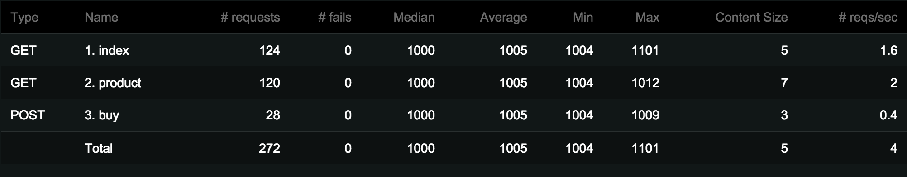
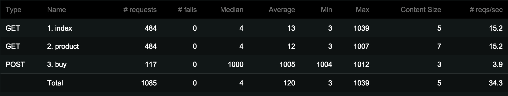
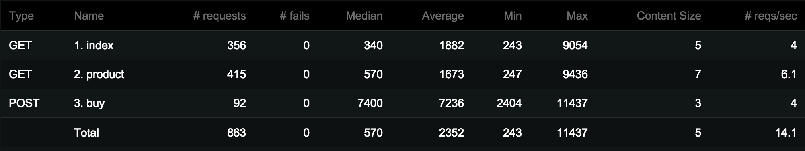
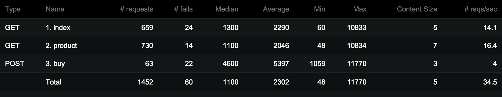
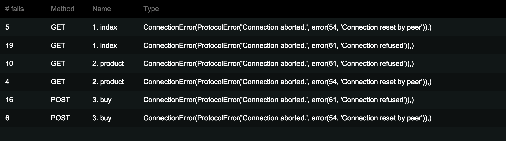

# Demo from [Pycon KR 2015](http://www.pycon.kr/2015/)

### [Load Testing with Locust.io](slides.pdf)

`main.py` is a simple Flask application with the following endpoints:

- `/`
- `/product`
- `/buy`

These urls are requested from `loadtest.py` which simulates a certain
user behaviour.


## 4 workers running the non-optimized app

```bash
gunicorn -w 4 -b 0.0.0.0:6000 main:app

locust -f loadtest.py -H http://localhost:6000 --port=6001
```

## 4 workers running the optimized app

```bash
gunicorn -w 4 -b 0.0.0.0:6000 main_cached:app

locust -f loadtest.py -H http://localhost:6000 --port=6001
```

## Locust running in master with 2 slave nodes
```bash
locust -f loadtest.py -H http://localhost:6000 --master --master-bind-port=5000 --port=6001

locust -f loadtest.py -H http://localhost:6000 --slave --master-port=5000
locust -f loadtest.py -H http://localhost:6000 --slave --master-port=5000
```

## Examples

### 1. 4 workers & 4 users using `main.app`



### 2. 4 workers & 4 users using `main_cached.app`



### 3. 4 workers & 100 users using `main_cached.app`



### 4. 4 workers & 200 users using `main_cached.app` produces failures




